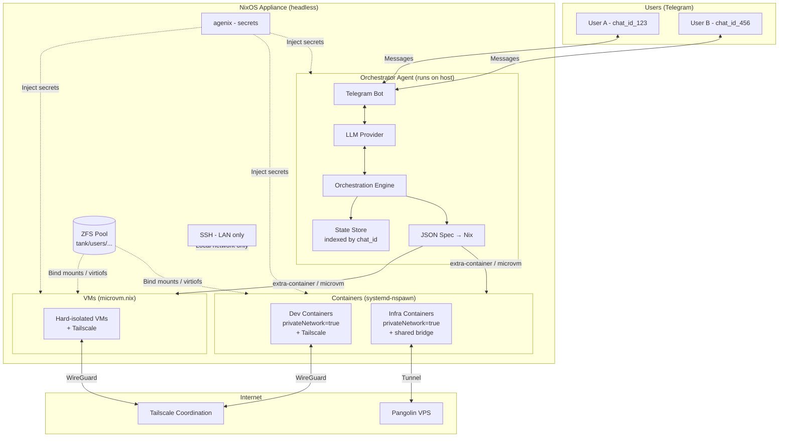
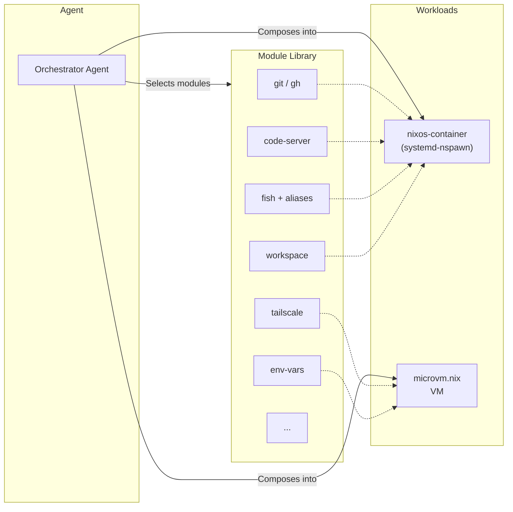
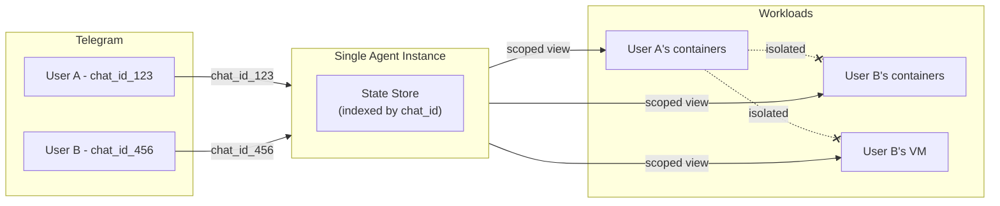
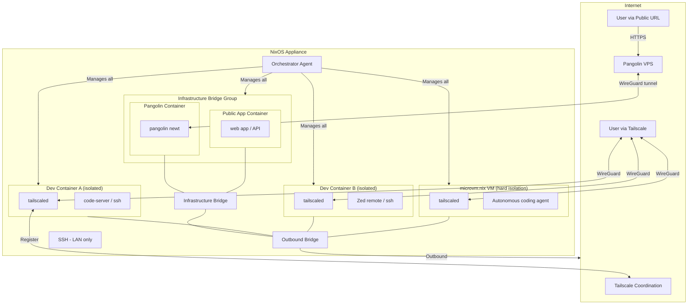
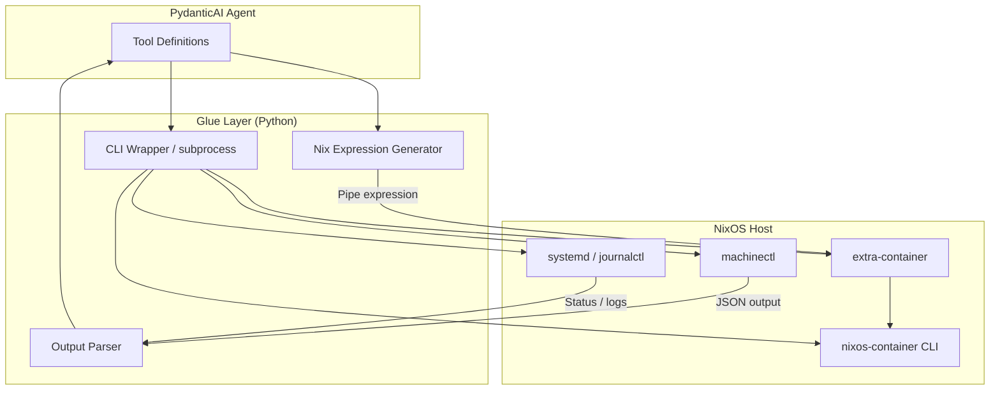
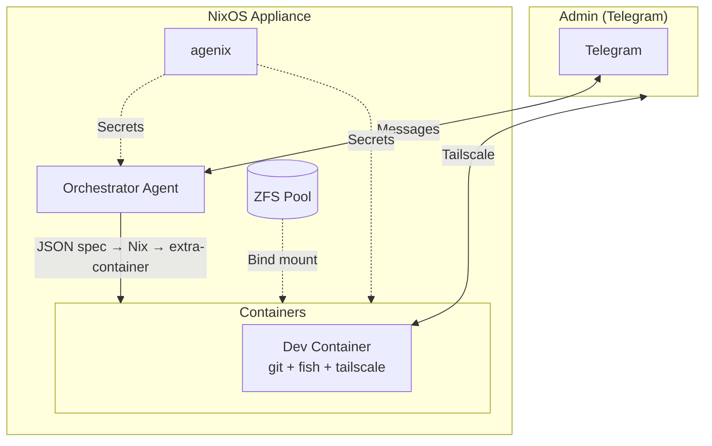

# Agentic NixOS Container Orchestrator

#idea #project

---

## Overview

A NixOS-based appliance — similar in spirit to Proxmox — that serves as a container and VM hypervisor. The primary user interface is not a web dashboard or CLI, but a **chat-based AI agent** accessible through Telegram. The user describes intent in natural language; the agent reasons about infrastructure state and orchestrates workloads accordingly.

**Target audience:** Self-hosted by the owner on personal hardware, shared with friends and family. Not a commercial multi-tenant platform.

**Scope:** This is an extensible project built across multiple sessions. The [Foundational MVP](#foundational-mvp) defines the minimum viable slice to start playing; the full architecture documented here is the long-term vision that the MVP builds toward.

### Origin

The idea began as a lightweight NixOS instance for spinning up isolated remote containers for agentic development. Through iteration, it evolved into a full orchestrator application: a purpose-built NixOS appliance with an AI agent as the control plane.

---

## High-Level Architecture



---

## Core Components

### 1. NixOS Host

A minimal, declaratively configured NixOS instance. The entire appliance is defined in Nix — reproducible, version-controlled, and auditable. The host provides:

- Container runtime (`nixos-container` + `extra-container`) and VM runtime (`microvm.nix`) — see [Workload Strategy](#workload-strategy)
- ZFS storage pool for persistent workload data
- Networking and resource isolation
- **The orchestrator agent runs directly on the host** as a systemd service (it needs host-level access to `machinectl`, `extra-container`, ZFS, etc.)

### 2. Orchestrator Agent

The central intelligence of the system. An **autonomous, interactive problem-solver** — not a static workflow executor. Modeled after the Claude Code pattern: given a task, it uses available tools to execute, diagnoses errors iteratively, and only escalates to the user when genuinely stuck.

- **Receives intent** via Telegram (additional chat platforms are a future enhancement)
- **Reasons about state** — what's running, what resources are available, what the user is asking for
- **Acts on infrastructure** — provisions, configures, starts, stops, and destroys containers/VMs
- **Self-corrects on failure** — analyzes errors, investigates root causes via tools, fixes misconfigs, retries. Escalates only on non-recoverable failures.
- **Reports outcomes** — user gets a summary of what was done (not a wall of errors). Full traces captured in Logfire for admin triage.

### 3. Chat Integration Layer

The primary user interface. Messaging platforms serve as the control plane:

- **Telegram** bot integration (v1). Additional platforms (Slack, etc.) are a future enhancement.
- Natural language input → agent interpretation → orchestration action
- Asynchronous by nature — fire off a request, get notified when it's done. Allow for hooks like intermittent updates / human in the loop

### 4. Secrets Management (agenix)

All credentials are injected at runtime via [agenix](https://github.com/ryantm/agenix). Nothing is hardcoded. The admin manages age keys via the local-network SSH backdoor; agenix decrypts at runtime on the host and into containers/VMs. Secrets are exposed as environment variables to the agent's systemd service via `EnvironmentFile`, making the agent binary **provider-agnostic** — the host NixOS config is the single source of truth for all configuration. Managed secrets include:

| Secret | Purpose |
|--------|---------|
| SSH host/user keys | Admin access authentication |
| Telegram bot token | Chat integration auth |
| LLM provider name | Agent model selection (e.g., `anthropic`, `openai`) |
| LLM provider API key | Agent intelligence |
| Tailscale auth keys | Per-container/VM tailnet enrollment |
| Pangolin newt credentials | Tunnel client authentication |
| *Additional runtime secrets* | *Injected into managed containers/VMs as needed* |

### 5. SSH Admin Access

Break-glass and maintenance access only:

- **Key-based authentication** (no passwords)
- **Local network only** — not exposed externally
- For direct host administration, debugging, and recovery
- Not the day-to-day interface — that's the chat agent

---

## Workload Strategy

No Docker. No Podman. The orchestrator uses **NixOS-native primitives** for both containers and VMs, composed from a shared library of reusable NixOS modules.

### Containers — `nixos-container` (systemd-nspawn)

Containers are declared as NixOS configurations and managed via `nixos-container`, which uses systemd-nspawn under the hood. Each container is a lightweight, isolated NixOS system built by composing modules from the module library.

- Declaratively defined — same NixOS module system as the host
- First-class NixOS feature — no third-party runtime needed
- The agent composes module selections into container definitions, then creates/starts/stops/destroys them

### VMs — `microvm.nix`

For workloads requiring stronger isolation or non-NixOS guests, VMs are managed via [microvm.nix](https://github.com/astro/microvm.nix) — declarative, NixOS-module-based VM management.

- Same module composition pattern as containers
- Supports multiple hypervisor backends (cloud-hypervisor, QEMU, firecracker, etc.)
- Suitable for workloads that need full kernel isolation

### Module Library

A curated set of **preconfigured, composable NixOS modules** that the agent selects from when building workloads. These are the building blocks:

| Module | Purpose |
|--------|---------|
| `git` / `gh` | Pre-authenticated Git + GitHub CLI |
| `tailscale` | Mesh networking / remote access per container |
| `code-server` | VS Code in the browser for remote dev |
| `fish` | Fish shell + custom aliases and environment |
| `env-vars` | Injected environment variables (via agenix) |
| `workspace` | Persistent ZFS-backed workspace (agent creates dataset via tool, module configures bind mount) |
| *...extensible* | *New modules added as needs arise* |

The agent understands the available modules, interprets user requests, and stitches together the right combination for each workload. Spin up, tear down, reconfigure on demand. See [Agent Capability Discovery](#agent-capability-discovery--experimental) for how the agent dynamically discovers available modules.



### Precompiled Images

To avoid long build times on every spin-up, the system supports **precompiled images**:

- Pre-evaluated Nix closures for common module combinations (e.g., "standard dev container" = git + fish + code-server)
- Exposed via a **query tool** the agent can call to list/select available images
- Backed by a local Nix binary cache on the host
- Custom compositions still built on-demand; frequently-used combos get cached/pre-built

---

## Trust Model & Multi-Tenancy

### Threat model

This is a **personal/homelab appliance** shared with people you trust — friends, family, collaborators. The security posture is **"good fences make good neighbors"**: protect users from each other's mistakes and from external threats, not from each other acting maliciously.

| Threat | Mitigation |
|--------|------------|
| User A accidentally affects User B's workloads | Agent enforces per-user scoping (ownership checks on every operation) |
| Runaway container eats all disk | ZFS quotas per user/container |
| Container compromised by malicious dependency | `privateNetwork=true` prevents lateral movement to other containers |
| Service accidentally exposed to internet | Tailscale-only by default; Pangolin requires explicit opt-in |
| Workload needs to run untrusted code | Escalate to microvm.nix VM for kernel-level isolation |

**What this is NOT designed for:** Hostile multi-tenancy where anonymous users actively try to escape isolation, attack each other, or exploit the system. That would require hardened VMs for everything, per-user kernel namespaces, audit logging, billing — a fundamentally different architecture.

### Multi-tenancy model — application-layer scoping

One agent instance serves multiple users. The chat platform provides identity; the agent enforces scoping.

- **Identity:** Telegram chat ID = user identity. No auth system to build — the platform handles it.
- **Agent state:** Chat ID indexes the in-memory store, acting as the thread/session ID. Each user gets their own conversation context and workload view.
- **Ownership enforcement:** Every agent tool checks `workload.owner == current_chat_id` before acting. User A cannot see, manage, or destroy User B's workloads.
- **Containers:** Scoped by owner. Naming convention or metadata tag ties each container to a chat ID.
- **VMs:** Same pattern. The VM doesn't know about the user system — it's just a workload the agent tracks as belonging to a specific user.
- **ZFS:** Per-user dataset scoping: `tank/users/<chat_id>/containers/<name>/workspace` (canonical layout — see [Host Storage](#host-storage--zfs))



### Infrastructure stays single-tenant

- **One admin** — host SSH access is for the owner only (local network, key-based)
- **One agent process** — multi-user at the application layer, not the OS layer
- **No per-user host accounts** — containers handle their own internal auth (Tailscale, code-server, SSH keys, etc.)
- **One agenix keychain** — admin manages all secrets. Per-user secrets (Tailscale keys, etc.) are still managed centrally by the admin via agenix.

---

## Networking Model

The host is a **headless appliance, not a workstation**. You don't SSH into it to work. You don't Tailscale into it. You talk to it through the agent (Telegram/Slack), and it manages workloads for you. The containers are the user-facing endpoints — each one exposes its own access surface and is responsible for its own network presence.

### Security & Isolation Model

The system provides **three tiers of isolation**, each mapping to a runtime and networking strategy:

| Tier               | Runtime                                                   | Networking                                | Isolation                              | Use Case                                              |
| ------------------ | --------------------------------------------------------- | ----------------------------------------- | -------------------------------------- | ----------------------------------------------------- |
| **Hard**           | `microvm.nix` VM                                          | Own kernel, own network stack             | Kernel-level (hypervisor boundary)     | Untrusted workloads, coding agents with full autonomy |
| **Soft isolated**  | `nixos-container` + `privateNetwork=true`                 | Own network namespace, veth to host       | Namespace-level (shared kernel)        | Standard dev containers, personal workloads           |
| **Soft networked** | `nixos-container` + `privateNetwork=true` + shared bridge | Own namespace, bridge to other containers | Namespace-level, inter-container comms | Infrastructure services (Pangolin, etc.)              |

#### Why VMs for hard isolation

systemd-nspawn containers share the host kernel — root in a container can escape to the host ([NixOS docs explicitly warn about this](https://nlewo.github.io/nixos-manual-sphinx/administration/containers.xml.html)). VMs run their own kernel, reducing the attack surface to the hypervisor. microvm.nix is purpose-built for this: its own docs make ["The Case Against Containers"](https://microvm-nix.github.io/microvm.nix/) for security-sensitive workloads.

This is a validated pattern. Michael Stapelberg published ["Coding Agent VMs on NixOS with microvm.nix"](https://michael.stapelberg.ch/posts/2026-02-01-coding-agent-microvm-nix/) — the exact same use case: ephemeral VMs for coding agents where compromise is expected and disposability is the mitigation.

#### Why not `privateNetwork=false`

When `privateNetwork=false`, the container shares the **entire host network namespace**. It can bind to any host port, see all host network traffic, and interfere with other services — including the orchestrator agent. This effectively undoes any isolation benefit. **All containers should use `privateNetwork=true`.**

For containers that need to talk to each other (e.g., infrastructure services), use a **shared bridge** instead. Containers on the same bridge can communicate, but they're still isolated from the host's network namespace. The host controls routing between the bridge and the outside world.

#### Pangolin in a container — rationale

Pangolin (the newt client) runs in its own container rather than on the host:

- **Keeps the host minimal** — consistent with the appliance model. The host runs the agent and nothing else.
- **Defense-in-depth** — Pangolin credentials and tunnel config are not on the host. A partial exploit in a dev container can't reach them.
- **Caveat:** Against a *full* nspawn container escape (attacker gains host root), isolation is marginal — they can access any container's filesystem at `/var/lib/nixos-containers/<name>`. For true isolation of infrastructure from dev workloads, run Pangolin in a **microvm.nix VM** instead.

### Access Tiers

| Access Type | Tool | Use Case |
|-------------|------|----------|
| **Private** | Tailscale (per-container/VM) | Dev work, personal access, SSH, code-server, Zed |
| **Public** | Pangolin (tunnel to VPS) | Demos, webhooks, staging, public-facing services |
| **Admin** | SSH (local network only) | Host maintenance, break-glass |

### Private access — Tailscale

Each container/VM runs its own `tailscaled` and gets its own identity on the user's tailnet. This is an [established pattern](https://tailscale.com/kb/1112/userspace-networking) — Tailscale officially supports per-container deployment, and systemd-nspawn containers typically have access to `/dev/net/tun` for full kernel-mode Tailscale (userspace mode available as fallback).

- Container joins tailnet → gets a stable hostname/IP → user connects directly
- No NAT, port forwarding, or reverse proxy on the host
- Auth keys injected via agenix (or generated on-the-fly via Tailscale API)

### Public access — Pangolin

[Pangolin](https://github.com/fosrl/pangolin) is a self-hosted tunneled reverse proxy (Cloudflare Tunnel alternative). It uses Traefik + WireGuard tunnels via its "newt" client — no inbound ports needed on the LAN.

- Pangolin server runs on an external VPS (one-time setup, outside the appliance)
- Pangolin newt client runs in a **dedicated infrastructure container** on the shared bridge (or VM for stronger isolation). Not a per-container module — centralized for security.
- Services needing public access are placed on the shared bridge alongside the Pangolin container, which tunnels traffic out
- No port forwarding on the host or home network required

### Host networking

Minimal. The host only needs:

- **Local bridge / veth** for containers to reach the internet (so Tailscale and Pangolin can connect out)
- **Infrastructure bridge** for containers that need to communicate with each other (e.g., app container ↔ Pangolin container)
- **Local SSH** on the LAN for admin maintenance
- No Tailscale, no public exposure, no reverse proxy

### Inter-workload networking



---

## Persistence Model

### Why NixOS workloads are "ephemeral"

In NixOS, the system configuration is a **function, not filesystem state**. A Nix expression evaluates to a complete system closure in `/nix/store` — binaries, config files, systemd units, all of it. The "live" system (`/etc`, `/run`, etc.) is just symlinks into the store. Nothing about the system needs to survive between runs because the Nix expression is the source of truth, and the store (on the host) caches built artifacts. Destroy and recreate a container with the same modules → bit-for-bit identical system.

**User data** — repos, databases, runtime-created files — is the only thing that can't be derived from a Nix expression. That's the only thing that needs explicit persistence.

This is an advantage for the orchestrator: the agent can fearlessly destroy and recreate workloads without losing anything meaningful, as long as persistent mounts are configured. **The system is cattle, the data is pets.**

### Containers (`nixos-container`)

- `ephemeral = true` → root filesystem wiped on restart (tmpfs). `false` (default) → persists at `/var/lib/nixos-containers/<name>`
- `/nix/store` is **always shared** with the host via read-only bind mount — packages and builds are never lost
- **`bindMounts`** map host directories into the container for explicit persistent state (e.g., repos, working directories)

### VMs (`microvm.nix`)

- Root filesystem is **tmpfs by default** — truly ephemeral out of the box
- Persistence via **`microvm.shares`** — virtiofs mounts mapping host directories into the VM
- Same pattern: system is disposable, data is explicitly persisted through shared mounts

### Host Storage — ZFS

Persistent workload data is stored on a **ZFS pool** on the host. Each container/VM gets its own dataset.

- **32GB RAM** available on the host — comfortable for ZFS ARC cache alongside containers and the agent
- ARC max should be capped (e.g., `options.zfs.arc.max = 8GB`) to leave headroom for workloads
- Pool and dataset layout defined declaratively in the host NixOS config (e.g., via `disko`)

#### Layout

```
zpool: tank
├── tank/users/<chat_id>/containers/<name>/workspace   # bind-mounted into container
├── tank/users/<chat_id>/containers/<name>/cache        # optional build caches
├── tank/users/<chat_id>/vms/<name>/share               # virtiofs-shared into VM
└── tank/images                                         # precompiled image cache (shared)
```

#### Why ZFS over flat directories

- **Snapshots** — cheap, instant. Agent can auto-snapshot before destructive operations (tear down, reconfigure)
- **Atomic destroy** — `zfs destroy` is instant regardless of data size, vs. slow `rm -rf`
- **Quotas** — per-container disk limits enforced at filesystem level. No runaway build cache eating all disk.
- **Send/receive** — native incremental backups, easy replication to another machine
- **Compression** — transparent, especially effective for repos and build artifacts

### What to persist for dev workloads

| Data | Persistence | Mechanism |
|------|-------------|-----------|
| System config / packages | Not needed | Derived from Nix expression + store |
| Secrets | Not needed | Injected by agenix at runtime |
| Shell config / dotfiles | Not needed | Provided by NixOS modules |
| Cloned repos / WIP | **Persist** | ZFS dataset → bind mount / virtiofs share |
| Build caches | Optional | ZFS dataset — speeds up rebuilds, quotas prevent disk bloat |

---

## Implementation

### Tech Stack

| Component            | Technology                                                                                                          | Purpose                                                          |
| -------------------- | ------------------------------------------------------------------------------------------------------------------- | ---------------------------------------------------------------- |
| Agent framework      | [PydanticAI](https://github.com/pydantic/pydantic-ai)                                                               | Tool-calling agent with structured I/O                           |
| Language             | Python                                                                                                              | Agent application logic                                          |
| Chat interface       | Telegram Bot API                                                                                                    | Primary user interaction layer                                   |
| Observability        | [Logfire](https://logfire.pydantic.dev/)                                                                            | Trace visualization and debugging                                |
| Secrets              | agenix                                                                                                              | Runtime credential injection                                     |
| Host OS              | NixOS                                                                                                               | Declarative appliance definition                                 |
| Containers           | `nixos-container` (systemd-nspawn) + [`extra-container`](https://github.com/erikarvstedt/extra-container)           | Lightweight NixOS workloads without full rebuilds                |
| VMs                  | [`microvm.nix`](https://github.com/astro/microvm.nix)                                                               | Hard-isolated workloads with kernel-level boundaries             |
| Container management | `machinectl` + `nixos-container` CLI                                                                                | Lifecycle management (start, stop, destroy, list, logs)          |
| Host storage         | ZFS (via disko)                                                                                                     | Per-container/VM datasets with snapshots, quotas, atomic destroy |
| Initial provisioning | [nixos-anywhere](https://github.com/nix-community/nixos-anywhere) + [disko](https://github.com/nix-community/disko) | First-time appliance install (disk format + NixOS)               |
| Ongoing deployment   | `nixos-rebuild --target-host`                                                                                       | Push config updates to running appliance over SSH                |

### Agent-to-Nix Glue Layer

NixOS has **no REST or gRPC API** for container/VM management (unlike Podman). The interface is entirely CLI-based. The agent bridges this gap by wrapping CLI invocations as PydanticAI tools.

#### Why CLI wrapping is not fragile here

- `nixos-container` and `machinectl` are **core NixOS/systemd tools** with stable, minimal interfaces — not random scripts
- This is an **established pattern** — projects like [`python-nixos-nspawn`](https://github.com/m1cr0man/python-nixos-nspawn) and [`nspctl`](https://github.com/mofm/nspctl) are Python wrappers around the same CLIs
- Commands have well-defined exit codes and predictable output
- PydanticAI tool definitions provide input validation for free
- Newer `machinectl` supports `--output=json`, reducing stdout parsing risk

#### `extra-container` — key discovery

[`extra-container`](https://github.com/erikarvstedt/extra-container) allows creating declarative NixOS containers **without a full system rebuild**. The agent can:

1. Compose a Nix expression from selected modules
2. Pipe it to `extra-container`
3. Get a running container — no `nixos-rebuild` required

This is a cleaner interface than raw `nixos-container` for dynamic, on-demand workloads.

#### Nix expression generator — JSON spec approach

The agent **never writes Nix syntax**. Instead, it generates a Pydantic-validated JSON spec, and a Nix function in the repo consumes it to produce the full workload definition. Clean separation: Python owns the "what," Nix owns the "how."

**Flow:**

1. Agent produces a JSON spec:
```json
{
  "name": "dev-abc",
  "owner": "chat_id_123",
  "type": "container",
  "modules": ["git", "fish", "code-server", "tailscale"],
  "workspace": false
}
```

2. A Nix function in `nix/` reads the spec and composes the modules:
```nix
# Simplified — the module library handles the real composition
{ spec }:
let
  moduleMap = { git = ./modules/git; fish = ./modules/fish; /* ... */ };
  selectedModules = map (m: moduleMap.${m}) spec.modules;
in
  mkContainer { name = spec.name; imports = selectedModules; }
```

3. Agent calls: `nix eval .#mkContainer --arg spec ./spec.json | extra-container create --start`

**Why this works:**

- **Agent generates structured data, not Nix** — Pydantic validates the spec before it touches Nix. No risk of invalid syntax.
- **All composition logic lives in Nix** — module imports, dependency resolution, networking config, all handled by the Nix module system.
- **Module library is independently testable** — `nix build .#mkContainer --arg spec ./test-spec.json` works without the agent.
- **Maps to the monorepo** — `agent/` generates specs, `nix/modules/` defines building blocks, `nix/` exports the `mkContainer`/`mkVM` functions.

### Deployment Workflow

The monorepo is the single source of truth. Deployments flow through the admin SSH backdoor we already designed.

#### Initial provisioning — `nixos-anywhere`

One-time setup. Takes a bare machine (or any running Linux), formats disks via `disko`, installs the full NixOS appliance configuration.

```
nixos-anywhere --flake .#appliance root@192.168.x.x
```

#### Ongoing updates — `nixos-rebuild`

Push configuration changes (new modules, agent updates, host config) to the running appliance:

```
nixos-rebuild switch --flake .#appliance --target-host admin@192.168.x.x --use-remote-sudo
```

- **Atomic and rollbackable** — `nixos-rebuild switch --rollback` if something breaks
- **Module library updates are instant** — add a module to `nix/modules/`, deploy, agent can offer it immediately (no agent restart needed unless Python code changed)
- **Agent code updates** — if the Python agent changed, the systemd service restarts as part of the rebuild

#### Update workflow

1. Developer adds/modifies code in the monorepo (new module, agent feature, host config)
2. `nixos-rebuild switch --flake .#appliance --target-host admin@192.168.x.x`
3. Host rebuilds atomically — new modules, agent updates, config changes all applied together
4. Users see changes immediately on their next interaction

### Agent Tool Architecture

The orchestrator agent exposes infrastructure operations as PydanticAI tools. Each tool wraps one or more CLI invocations with Pydantic models for input validation and structured output.



#### Core tools (indicative, not exhaustive)

| Tool                 | Wraps                           | Purpose                                              |
| -------------------- | ------------------------------- | ---------------------------------------------------- |
| `create_container`   | `extra-container`               | Compose modules → Nix expression → running container |
| `destroy_container`  | `nixos-container destroy`       | Tear down a container and its filesystem             |
| `start_container`    | `nixos-container start`         | Start a stopped container                            |
| `stop_container`     | `nixos-container stop`          | Stop a running container                             |
| `list_workloads`     | `machinectl list --output=json` | Query running containers and VMs                     |
| `container_logs`     | `journalctl -M <name>`          | Retrieve container logs                              |
| `list_images`        | Custom (query Nix store)        | List precompiled images available                    |
| `run_in_container`   | `nixos-container run`           | Execute a command inside a container                 |
| `create_vm`          | `microvm.nix`                   | Compose modules → Nix expression → running VM        |
| `destroy_vm`         | `microvm.nix`                   | Tear down a VM                                       |
| `create_zfs_dataset` | `zfs create`                    | Provision persistent storage for a workspace module  |

#### Flow: user request → running container

1. **User** (via Telegram): *"Spin up a dev container with git, fish, and code-server"*
2. **Chat layer** receives message, passes to PydanticAI agent
3. **Agent** reasons about request, selects `create_container` tool with modules `[git, fish, code-server]`
4. **Nix Expression Generator** composes a container definition importing the selected modules
5. **CLI Wrapper** pipes the expression to `extra-container create --start`
6. **Output Parser** captures the result (success/failure, container name, IP)
7. **Agent** responds to user via Telegram: *"Container `dev-abc` is running at 192.168.100.12 — code-server available on port 8080"*

### Agent Capability Discovery *(experimental)*

Rather than hardcoding all tools and module knowledge into the agent, a **lazy-loading pattern** dynamically manages the agent's capabilities:

- **Dynamic index in system prompt:** Available capabilities (modules, tools, context) are listed as IDs with concise descriptions, injected into the system prompt at interaction time
- **`fetch` tool:** Given an ID, the agent can either insert the relevant context into the conversation or append the associated tool into its available tool set
- **Build-up from ground state:** The agent starts minimal and discovers/loads capabilities on demand, preserving context window space
- **Automatic context compaction:** When the context window grows large, loaded tools and context are pruned back to the base set, keeping the agent responsive

This pattern solves module discovery (agent knows what's available without hardcoding), scales naturally (adding a module = adding an index entry), and preserves context for reasoning rather than wasting it on unused tool definitions.

**Open questions:**
- Who populates the index? Derived from the Nix module map at deploy time, or manually maintained?
- Compaction strategy — reset to base set, or smart pruning (keep recently-used, drop stale)?
- Per-user index scoping — global capabilities vs. user-specific views?

### State Management

The agent tracks three kinds of state, each with a different strategy:

| State                                                                 | Source of truth                           | Persistence                                                   | Indexed by |
| --------------------------------------------------------------------- | ----------------------------------------- | ------------------------------------------------------------- | ---------- |
| **Live workload status** (running, stopped, IPs)                      | systemd / `machinectl list --output=json` | None — always queried live                                    | N/A        |
| **Ownership + metadata** (who owns what, modules used, creation time) | Agent-managed store                       | Persisted to disk (mechanism TBD — SQLite, JSON in ZFS, etc.) | `chat_id`  |
| **Conversation context** (multi-turn interaction)                     | PydanticAI in-memory                      | Not persisted — lost on restart (acceptable)                  | `chat_id`  |

Live status always comes from systemd — it's the ground truth. Ownership must be persisted so a host reboot doesn't orphan containers. Conversation context is ephemeral by nature.

#### Enhancement: context injection over tool queries

Rather than forcing the agent to query live state via tool calls on every interaction, a **context engineering** approach can inject a tailored live status summary into the system prompt (or top of context) before the agent processes each message. The agent starts every interaction already knowing the user's current workloads, status, and resource usage — no round-trips needed.

This reduces tool call overhead, lowers latency, and gives the agent a complete picture from the first token. The specific implementation (system prompt injection, dynamic context assembly, hybrid with on-demand tool queries for deeper inspection) will evolve, but the concept is: **prefer context injection for ambient state, reserve tool calls for targeted actions and investigations.**

### Agent Behavior — Error Handling & Self-Correction

The agent is an **autonomous problem-solver**, not a script runner. When it encounters an error, it reasons about the failure, uses its tools to investigate and fix, and only escalates when genuinely stuck. The user gets a report on work completed, not raw error output.

#### Intent (conceptual — implementation details will evolve)

- **On error:** Agent receives the error context, classifies it (build failure, service crash, resource limit, misconfig, etc.), and decides whether it can self-correct or must escalate.
- **Self-correction:** If the error is a fixable misconfig or partial implementation issue, the agent modifies the spec/modules and retries. E.g., incompatible module combination → agent queries module definitions, identifies the conflict, adjusts, rebuilds.
- **Escalation:** Non-recoverable failures (resource exhaustion, infrastructure down, permissions) are surfaced to the user with a plain-language summary.
- **Observability:** All attempts, errors, and traces are captured in Logfire. The admin can use the agent itself to triage issues from the full trace data.

#### Example: self-correcting build failure

1. Agent attempts to create a container with `[git, code-server, tailscale]`
2. Build fails — Nix reports a port conflict between code-server and another service
3. Agent queries the `code-server` module definition, identifies the default port
4. Agent adjusts the spec to use a non-conflicting port, rebuilds
5. Container starts successfully
6. Agent reports to user: *"Container `dev-xyz` is running. Note: code-server moved to port 8081 to avoid a conflict with tailscale."*

#### Example: non-recoverable escalation

1. Agent attempts to create a container
2. Build fails — ZFS quota exceeded for this user
3. Agent recognizes this as a resource limit it cannot fix autonomously
4. Agent reports: *"Couldn't create the container — your storage quota is full. You can free space by destroying unused containers, or ask the admin to increase your quota."*

#### Possible tool enhancements (ideas, not commitments)

- **`query_module`** — inspect a module's definition, ports, dependencies, conflicts
- **`read_build_log`** — parse Nix build output for structured error info
- **`inspect_container`** — check running service status, resource usage inside a container
- Advanced context engineering, prompt chaining, human-in-the-loop, and tool composition will evolve as the agent matures

---

## Foundational MVP

The full architecture is the long-term vision. The MVP defines the minimum slice to get a working system for iterative development across future sessions.

### MVP Scope

| In | Out (future iterations) |
|----|------------------------|
| NixOS host with `nixos-container` + `extra-container` | `microvm.nix` VMs |
| ZFS pool + per-user datasets via `disko` | Precompiled image cache |
| agenix for all secrets | Dynamic Tailscale API key generation |
| Base modules: `git`, `fish`, `tailscale`, `workspace` | `code-server`, `env-vars`, additional modules |
| Python agent (PydanticAI) with core container tools | Agent capability discovery (lazy-loading) |
| Telegram bot integration | Slack, additional chat platforms |
| Single-user (admin is the only user) | Multi-user with chat_id scoping |
| Logfire tracing | API server, frontends (TUI/web) |
| `nixos-anywhere` initial provisioning | Pangolin public access tunneling |
| `nixos-rebuild` deployment workflow | CI pipeline, Cachix binary cache |

### MVP Architecture



### MVP Build Steps

1. **NixOS host config** — minimal appliance with `extra-container`, ZFS, agenix, SSH
2. **Base modules** — `git`, `fish`, `tailscale`, `workspace` as composable NixOS modules
3. **`mkContainer` Nix function** — consumes JSON spec, composes modules
4. **Python agent** — PydanticAI with core tools (`create_container`, `destroy_container`, `list_workloads`, `create_zfs_dataset`)
5. **Telegram bot** — wire agent to Telegram Bot API
6. **Deploy** — `nixos-anywhere` to provision, `nixos-rebuild` to iterate

### What MVP proves

- The JSON spec → Nix module composition → `extra-container` pipeline works end-to-end
- The agent can autonomously create and manage containers from natural language
- The declarative appliance model (Nix all the way down) is viable for this use case
- The foundation supports iterative enhancement (add modules, add multi-user, add VMs, add Pangolin)

---

## Decision Log

All design questions resolved during brainstorming. Grouped by topic for reference.

**Agent-to-Nix Interface:** Uses `extra-container` (no full rebuilds). CLI wrapping is an established pattern. JSON spec approach — agent generates structured data, Nix function composes modules. Agent never writes Nix syntax.

**Agent Behavior:** Autonomous problem-solver. Self-corrects fixable errors, escalates non-recoverable failures. Full traces in Logfire. Capability discovery via lazy-loading (experimental). State: live from systemd, ownership persisted to disk (indexed by chat_id), conversation in-memory. Context injection preferred over constant tool queries.

**Persistence:** System is always reproducible from Nix; user data uses bind mounts / virtiofs shares. ZFS with per-user datasets. Workspace is a module like any other — no auto-provisioning.

**Networking:** Tailscale per-container (established pattern). Host is a headless appliance — local SSH only. All containers use `privateNetwork=true`; inter-container comms via shared bridge (not `privateNetwork=false`). Pangolin runs in a dedicated infrastructure container, not per-container.

**Workload Runtime:** Containers are the default; VMs are an opt-in escalation (user specifies). Agent acts freely on most operations; confirmation only for destructive operations on persistent data. Single bridge to start.

**Configuration:** Single LLM provider, configurable via agenix env vars. Telegram for v1. All secrets via agenix.

**Multi-tenancy:** Multi-user via application-layer scoping. Telegram chat ID as identity. Agent enforces ownership. Infrastructure stays single-tenant.

---

## Prerequisites

### Pangolin VPS *(future — not part of MVP)*

A Pangolin server instance running on an external VPS is required for public access tunneling. This is a one-time setup, external to the NixOS appliance.

- **VPS provider:** TBD (any Linux VPS with a public IP)
- **Domain:** Required — Pangolin uses Traefik with Let's Encrypt for automatic TLS
- **Pangolin server setup:** *To be documented*
- **Networking:** TCP 80/443 (HTTP/HTTPS) + UDP 51820 (WireGuard) open on VPS
- **Integration:** Newt client credentials generated on the VPS, injected into the appliance via agenix

---

## Remaining Open Questions

All architectural questions from the brainstorming session are resolved. The following are implementation-level items to address when building:

- Agent capability discovery: index population, compaction strategy, per-user scoping (see [Agent Capability Discovery](#agent-capability-discovery-experimental))
- Ownership persistence mechanism: SQLite vs JSON in ZFS vs other
- Pangolin networking details (deferred until Pangolin is implemented)
- Bridge topology refinement (start single, reassess as infra services grow)

---

## Development Approach

### Phased hybrid — SDD + TDD + just build it

This project spans Nix infrastructure, Python application code, and frontends. No single methodology fits all components. Component-level specs add granular implementation detail per-phase.

### How this document is used

This brainstorming doc is the **architectural foundation** for the project. When the monorepo is created:

1. This file is copied into the repo as **`docs/architecture.md`**
2. The repo's **`AGENTS.md`** (or `CLAUDE.md`) references it as required reading — all implementation must align with the decisions documented here
3. Per-component spec-kit specs reference `docs/architecture.md` for context but add granular implementation detail (user stories, acceptance criteria, task breakdowns)

```
AGENTS.md                         # Dev conventions, rules, slash commands
└── references → docs/architecture.md   # This file — architectural decisions, constraints, design rationale
    └── referenced by → .specify/specs/  # Per-component spec-kit specs (agent, API, frontends)
```

The separation: `AGENTS.md` tells the agent *how to work*. `docs/architecture.md` tells it *what we're building and why*. Spec-kit specs tell it *what to implement right now*.

| Component | Methodology | Rationale |
|-----------|-------------|-----------|
| Nix host + modules | Just build it | Nix is declarative — the config IS the spec. Write modules, test with `nix build`, iterate. |
| Python agent + tools | SDD via [spec-kit](https://github.com/github/spec-kit) | Complex application logic, tool interfaces, state management. Benefits from formal specs → plan → tasks → implement. |
| Agent CLI wrappers / glue | TDD | Tests define the contract between Python and Nix. Nix expression generator, output parsers, ownership checks. |
| API server | SDD via spec-kit | API contracts, data models, endpoints — classic spec territory. |
| Frontends | SDD via spec-kit | UI specs, user stories, interaction flows. |

### Build order

1. **Nix host + base modules** — foundation. Everything depends on this.
2. **Agent core + CLI tools** — the brain. SDD spec + TDD for glue layer.
3. **Chat integration (Telegram)** — makes it usable.
4. **API server** — makes it observable.
5. **Frontends (TUI / web)** — polish.

### Workflow per phase

1. This doc provides architectural context and constraints
2. For SDD components: `spec-kit` spec → plan → tasks → implement (via Claude Code or similar)
3. For Nix components: write modules, `nix build`, `nix flake check`, iterate
4. For glue/integration: write tests first (pytest), then implement to pass
5. Deploy to appliance with `nixos-rebuild --target-host` and validate end-to-end

---

## Development Tooling

### Determinate Systems — verdict

- **Determinate Nix installer** → Yes. Better install experience, automatic GC. Their GitHub Actions (`nix-installer-action` + `magic-nix-cache-action`) dramatically speed up CI.
- **FlakeHub** → Deferred. Main value is private flake sharing for teams. For a public repo, [Cachix](https://www.cachix.org/) (free for OSS) covers binary caching. FlakeHub worth revisiting if we want to publish modules as a consumable flake for others.

### Recommended toolchain

| Tool | Purpose | Why |
|------|---------|-----|
| [`flake-parts`](https://github.com/hercules-ci/flake-parts) | Modular flake structure | **The big one.** Complex monorepo with multiple outputs. Each component gets its own composable flake module. |
| [`treefmt-nix`](https://github.com/numtide/treefmt-nix) | Multi-language formatting | One command formats Nix (`nixfmt`), Python (`ruff`), Markdown, etc. |
| [`pre-commit-hooks.nix`](https://github.com/cachix/pre-commit-hooks.nix) | Git hooks in Nix | Formatting, linting, flake checks — enforced pre-commit. |
| `devShells` via flake | Developer environment | `nix develop` gives contributors Python + uv + ruff + just + everything. Zero manual setup. |
| [`just`](https://github.com/casey/just) | Task runner | Wraps common workflows: `just test`, `just deploy`, `just fmt`. |
| `ruff` | Python linter + formatter | Fast, replaces flake8 + black + isort. |
| `pytest` | Python testing | Agent tools, expression generator, output parsers. |
| [Cachix](https://www.cachix.org/) | Binary cache (free for OSS) | Pre-built closures so users/CI don't rebuild from source. |
| Determinate `nix-installer-action` + `magic-nix-cache-action` | GitHub Actions CI | Fast Nix CI with automatic caching. |

### CI pipeline (GitHub Actions)

```
on: [push, pull_request]
  → nix flake check          # Nix builds, module tests, formatting
  → pytest agent/             # Python unit + integration tests
  → treefmt --check           # Formatting enforcement
  → nix build .#appliance     # Full appliance builds successfully
```

---

## Monorepo Structure

The project lives in a **public GitHub monorepo**. Based on current architecture, a natural modularization:

```
nixos-orchestrator/              # working name
├── flake.nix                    # Top-level flake (flake-parts)
├── flake.lock
├── parts/                       # flake-parts modules
│   ├── host.nix                 # NixOS appliance configuration
│   ├── modules.nix              # Workload module library + mkContainer/mkVM
│   ├── agent.nix                # Python agent package + devShell
│   ├── api.nix                  # API server package
│   ├── formatting.nix           # treefmt config (Nix + Python + Markdown)
│   ├── checks.nix               # CI checks (nix flake check)
│   └── devshell.nix             # nix develop environment
├── nix/                         # NixOS configuration
│   ├── host/                    # Host appliance NixOS config
│   ├── modules/                 # Reusable workload modules (git, fish, tailscale, etc.)
│   └── images/                  # Precompiled image definitions
├── agent/                       # Python — PydanticAI orchestrator agent
│   ├── tools/                   # Agent tool definitions (CLI wrappers, Nix glue)
│   ├── chat/                    # Telegram/Slack integration layer
│   └── nix_gen/                 # Nix expression generator
├── api/                         # API server for frontend consumption
├── frontends/
│   ├── tui/                     # Terminal UI
│   └── web/                     # Web dashboard
├── docs/                        # Architecture docs, ADRs
└── justfile                     # Task runner
```

Key boundaries:
- **`flake.nix` + `parts/`** — `flake-parts` modular flake. Each component gets its own composable module. `nix flake check` validates everything.
- **`nix/`** — pure Nix. Host config, workload modules, image defs. Independently testable with `nix build`.
- **`agent/`** — pure Python. The brain. Depends on `nix/modules` at runtime (generates expressions referencing them) but is independently developable/testable.
- **`api/`** — Python (likely FastAPI). Thin layer over orchestrator state. Could share models with agent.
- **`frontends/`** — independent consumers of the API. Can be built in any stack.

---

## Future Ideas

### API Server & Frontend(s)

A management UI for viewing and interacting with provisioned workloads. Rather than building a single monolithic frontend, expose an **API server** that multiple frontends can consume.

- **API server** runs in its own container — exposed publicly via Pangolin and/or privately via Tailscale
- Provides a read/write interface to the orchestrator: list workloads, view status, trigger actions
- Frontend options (build one or many, all consuming the same API):

| Frontend | Form Factor | Use Case |
|----------|-------------|----------|
| TUI | Terminal (e.g., Textual, Bubble Tea) | Quick checks from a terminal session |
| Web app | Browser | Full dashboard, richer visualization |
| Desktop app | Native (e.g., Tauri) | OS-level integration, notifications |

- The chat interface (Telegram/Slack) remains the primary *control* interface; the frontend(s) are primarily for *visibility* and *monitoring*
- API server could also serve as the integration point for the agent itself — agent calls the same API that frontends consume

---

## Related

- [[Homelab/Overview]]
